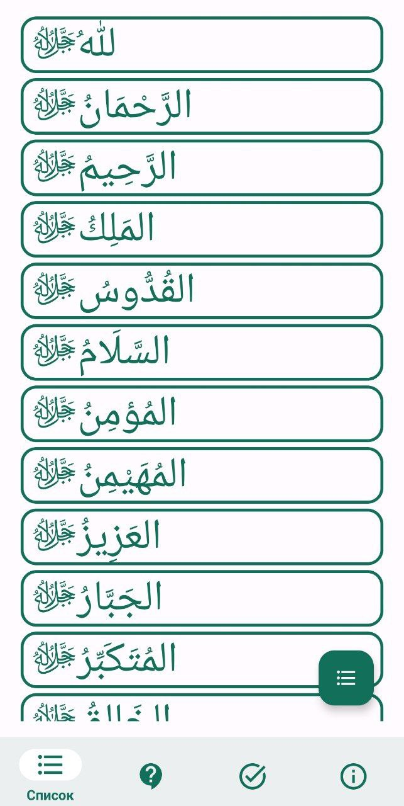
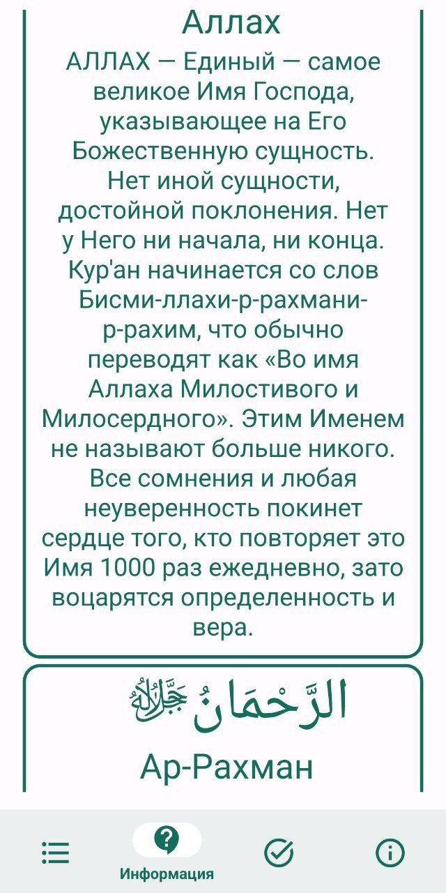
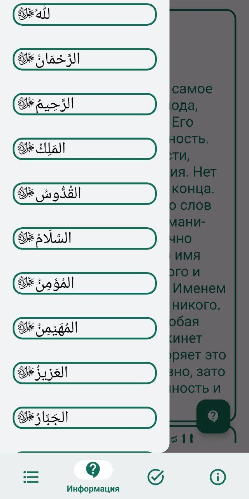
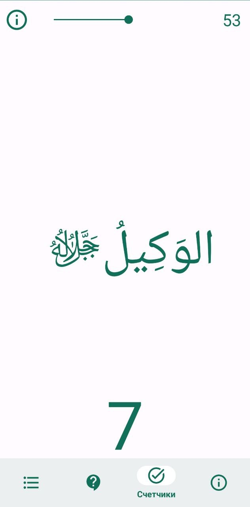
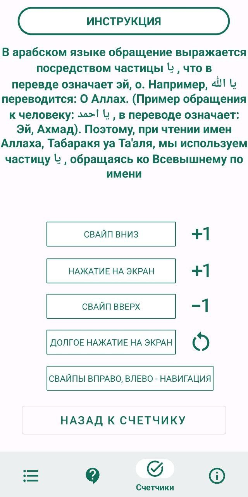

<h1 align="center">Al_Asma_Ul_Husna</h1>

  
  
  
  
  

## 🆕 Material3 Design Al Asma Ul Husna for Android
## ⚠ Join [@Tabiin/Al_Asma_Ul_Husna](https://t.me/+Lkw3ON0EsjZlNDIy) on Telegram for important updates.
## 📱 Screenshots
|  |  |  |  |  |  |
|:---:|:---:|:---:|:---:|:---:|:---:|
| Splash Screen | Screen Names | Screen Info | Screen Drawer Content | Screen Counter | Screen Tutorial |

## 🧭 Navigation never made easier 
Self-explanatory interface without overloaded menus

## 📦 Included Features
- 99 names of Allah in Arabic for quick reading. Read the beautiful names of the Almighty every day
- Translation, transcription and information, description of the names and qualities of Allah. Study the names of Allah for His pleasure
- Convenient swipe counter. Remember Allah many times. Read and study the names of Allah Almighty for His pleasure
- Share information with Muslims. The one who points to the good is entitled to the reward of the one who does the good
- Subscribe to the VK group "[Tabiin](https://vk.com/public213851453)", receive and disseminate knowledge

