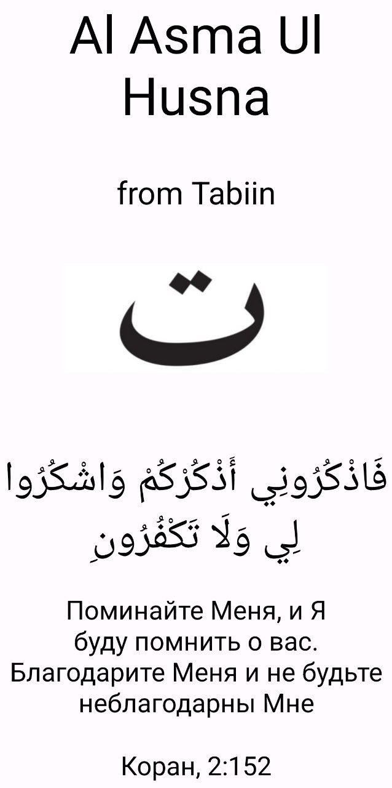

<h1 align="center">Al_Asma_Ul_Husna</h1>

  
  
  
  
  

## 🆕 Material3 Design Al Asma Ul Husna for Android
## ⚠ Join [@Tabiin/Al_Asma_Ul_Husna](https://t.me/+Lkw3ON0EsjZlNDIy) on Telegram for important updates.
## 📱 Screenshots
|  |  |  |  |  |  |
|:---:|:---:|:---:|:---:|:---:|:---:|
| Splash Screen | Screen Names | Screen Info | Screen Drawer Content | Screen Counter | Screen Tutorial |

## 🧭 Navigation never made easier 
Self-explanatory interface without overloaded menus

## 📦 Included Features
- 99 names of Allah in Arabic for quick reading. Read the beautiful names of the Almighty every day
- Translation, transcription and information, description of the names and qualities of Allah. Study the names of Allah for His pleasure
- Convenient swipe counter. Remember Allah many times. Read and study the names of Allah Almighty for His pleasure
- Share information with Muslims. The one who points to the good is entitled to the reward of the one who does the good
- Subscribe to the VK group "[Tabiin](https://vk.com/public213851453)", receive and disseminate knowledge

## ❓ FAQ
In any case, you find or notice any bugs please report them by creating an issue or by contacting us in the [Telegram](https://t.me/+piqy_5XsV1Q2YTZi) and [VK](https://vk.me/join/iUcAiwD_m9cPQRCV2Yikjt4SjHiDYzjrN3k=) group.

If you have any feature suggestions, please create an issue with detailed information or by contacting us in the [Telegram](https://t.me/+piqy_5XsV1Q2YTZi) and [VK](https://vk.me/join/iUcAiwD_m9cPQRCV2Yikjt4SjHiDYzjrN3k=) group.

___

## 🔗 Social links
**Telegram channel:** https://t.me/+Lkw3ON0EsjZlNDIy  
**Telegram group:** https://t.me/+piqy_5XsV1Q2YTZi  
**Telegram group:** https://t.me/+QTIZZFhT__ZjMmFi  
**VK group:** https://vk.com/public213851453  
**VK chat:** https://vk.me/join/iUcAiwD_m9cPQRCV2Yikjt4SjHiDYzjrN3k=  
**VK chat:** https://vk.me/join/05C90PnTAJ6W_pmmccpIwlzZbpHAX1SgcG0=  
**Crowdin**: https://crowdin.com/project/al-asma-ul-husna  

## 🗂️ License
# Al Asma Ul Husna is released under the Apache License 2.0.
A permissive license whose main conditions require preservation of copyright and license notices. Contributors provide an express grant of patent rights. Licensed works, modifications, and larger works may be distributed under different terms and without source code.

| Permissions | Limitations| Conditions | 
|✅ Commercial use | ❌ Trademark use | 🛈 License and copyright notice |
|✅ Modification | ❌ Liability | 🛈 State changes |
|✅ Distribution | ❌ Warranty | 
|✅ Patent use | 
|✅ Private use | 
|:---:|:---:|:---:|
